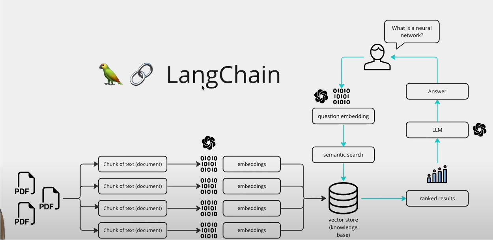

# README

## Required Environment
- Python 3.10

## Adopted Libraries
- `chainlit`: A library for building chat applications.
- `langchain`: A library for natural language processing, document retrieval, and related tasks.
- `os`: The Python standard library module for interacting with the operating system.
- `Chroma`: A library for vectorizing and retrieving documents.

## SYSTEM ARCHITECTURE




## Flow of Execution

### Message Handling
- The `@cl.on_message` decorator indicates that the `main` function is triggered when a new message is received.

### Main Function (`main`)
- The `main` function is an asynchronous function that processes incoming messages.
- It calls the `llm` function to generate a response based on the content of the incoming message.
- The response is then sent back using `cl.Message(content=response).send()`.

### LLM Function (`llm`)
- Configures the OpenAI API key in the environment.
- Defines a persistent directory for storing vectorized documents (`persist_directory`).
- Initializes an `OpenAIEmbeddings` instance for document embedding.
- Calls the `loadResourceDocuments` function to load and vectorize documents using Chroma.
- Configures a retriever for the vectorized documents.
- Uses a `RetrievalQA` chain with a `ChatOpenAI` language model to generate a response.
- The response includes the result and the source of the information.
- The result is printed, and the response is returned.

### Load Resource Documents Function (`loadResourceDocuments`)
- Loads documents from a PDF file using `PyPDFLoader`.
- Splits the documents into text chunks using `CharacterTextSplitter`.
- Initializes an `OpenAIEmbeddings` instance.
- Creates a Chroma vector database from the documents.
- Persists the vectorized documents.

## Command to Run the File
```
$pip install chainlit langchain chromadb openai pypdfloader
$ chainlit run response.py -w
```

## Issue
- OpenAI API key needs to be replaced in the code for the code to execute in local

## Feedback
- Consider using a configuration file or environment variables for sensitive information like API keys, allowing for easier management.
